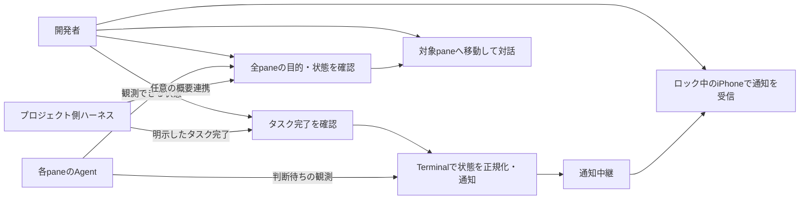

# 利用者と外部システムの役割

```mermaid
flowchart LR
    User[開発者]
    Harness[プロジェクト側ハーネス]
    Agent[各paneのAgent]
    Relay[通知中継]
    Notify[Terminalで状態を正規化・通知]
    Overview[全paneの目的・状態を確認]
    Navigate[対象paneへ移動して対話]
    Completion[タスク完了を確認]
    Mobile[ロック中のiPhoneで通知を受信]
    User --> Overview
    User --> Navigate
    User --> Completion
    User --> Mobile
    Agent -->|観測できる状態| Overview
    Harness -->|任意の概要連携| Overview
    Harness -->|明示したタスク完了| Completion
    Overview --> Navigate
    Completion --> Notify
    Agent -->|判断待ちの観測| Notify
    Notify --> Relay
    Relay --> Mobile
```

状態の正規化と通知送出はTerminalが担当する。ハーネスのフェーズ進行は管理しない。
